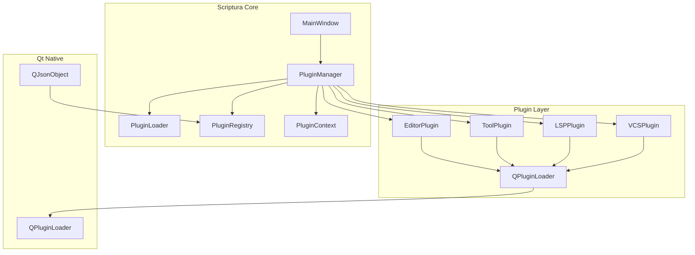

# Scriptura Qt 原生插件系統完整規劃

## 1. 系統架構總覽



## 2. 核心介面設計

### 2.1 基礎插件介面

```cpp
// plugininterface.h
class ScripturaPlugin
{
public:
    virtual ~ScripturaPlugin() = default;
    
    // 生命週期
    virtual bool initialize(PluginContext* context) = 0;
    virtual void shutdown() = 0;
    
    // 元數據
    virtual QString id() const = 0;
    virtual QString name() const = 0;
    virtual QString version() const = 0;
    virtual QString author() const = 0;
    virtual QString description() const = 0;
    
    // 依賴
    virtual QStringList dependencies() const = 0;
    
    // 功能查詢
    virtual bool hasFeature(PluginFeature feature) const = 0;
};

Q_DECLARE_INTERFACE(ScripturaPlugin, "com.scriptura.plugin/1.0")
```

### 2.2 功能特徵枚舉

```cpp
// pluginfeature.h
enum class PluginFeature {
    // 編輯器功能
    EditorExtension,        // 編輯器擴展
    SyntaxHighlighting,     // 語法高亮
    CodeCompletion,         // 程式碼補全
    
    // 工具功能
    ToolPanel,              // 工具面板
    StatusBarWidget,        // 狀態列元件
    MenuAction,             // 選單動作
    
    // 專案功能
    ProjectWizard,          // 專案精靈
    BuildSystem,            // 構建系統
    FileExplorer,           // 檔案瀏覽
    
    // 分析功能
    LSPProvider,            // LSP 提供者
    DiagnosticsProvider,    // 診斷提供者
    Formatter,              // 格式化工具
    
    // 整合功能
    VCSIntegration,         // 版本控制
    TerminalEmulator,       // 終端機
    ExternalTool            // 外部工具
};
```

### 2.3 插件上下文

```cpp
// plugincontext.h
class PluginContext
{
public:
    // 核心服務
    MainWindow* mainWindow() const;
    QSettings* settings() const;
    QActionManager* actionManager() const;
    
    // 編輯器服務
    EditorManager* editorManager() const;
    TextEditor* currentEditor() const;
    
    // 專案服務
    ProjectManager* projectManager() const;
    
    // 訊息服務
    StatusBar* statusBar() const;
    OutputPane* outputPane() const;
    
    // 插件間通訊
    QObject* getPlugin(const QString& id) const;
    template<typename T> T getPlugin(const QString& id) const;
    
    // 事件系統
    void notify(const QString& event, const QVariant& data = QVariant());
    void subscribe(const QString& event, std::function<void(const QVariant&)> callback);
};
```

## 3. 插件管理器實作

### 3.1 PluginManager 類別

```cpp
// pluginmanager.h
class PluginManager : public QObject
{
    Q_OBJECT
public:
    explicit PluginManager(QObject* parent = nullptr);
    ~PluginManager();
    
    // 插件生命週期
    bool loadPlugins(const QString& pluginPath);
    bool loadPlugin(const QString& filePath);
    void unloadPlugin(const QString& id);
    void unloadAllPlugins();
    
    // 插件查詢
    QList<ScripturaPlugin*> plugins() const;
    ScripturaPlugin* getPlugin(const QString& id) const;
    bool isLoaded(const QString& id) const;
    
    // 功能查詢
    QList<ScripturaPlugin*> pluginsWithFeature(PluginFeature feature) const;
    
    // 事件系統
    void publishEvent(const QString& event, const QVariant& data = QVariant());
    void subscribeToEvent(const QString& event, 
                         std::function<void(const QVariant&)> callback);
    
signals:
    void pluginLoaded(const QString& id);
    void pluginUnloaded(const QString& id);
    void pluginError(const QString& id, const QString& error);

private:
    bool loadPluginMetadata(const QString& filePath, QJsonObject& metadata);
    bool checkDependencies(const QJsonObject& metadata);
    bool resolveDependencies();
    void initializePlugins();
    void setupPluginConnections(ScripturaPlugin* plugin);
    
    struct PluginInfo {
        QString filePath;
        QJsonObject metadata;
        QPluginLoader* loader;
        ScripturaPlugin* instance;
        bool initialized;
        QStringList dependencies;
    };
    
    QHash<QString, PluginInfo> m_plugins;
    QHash<QString, QStringList> m_dependencyGraph;
    QMultiHash<QString, std::function<void(const QVariant&)>> m_eventHandlers;
};
```

### 3.2 插件發現機制

```cpp
// pluginmanager.cpp
bool PluginManager::loadPlugins(const QString& pluginPath)
{
    QDir dir(pluginPath);
    if (!dir.exists()) return false;
    
    // 遞歸掃描所有子目錄
    dir.setFilter(QDir::Dirs | QDir::NoDotAndDotDot);
    dir.setSorting(QDir::DirsFirst);
    
    // 第一階段：掃描並加載元數據
    QList<QJsonObject> pluginMetadata;
    for (const QFileInfo& info : dir.entryInfoList()) {
        if (info.isDir()) {
            QString metadataFile = info.absoluteFilePath() + "/plugin.json";
            if (QFile::exists(metadataFile)) {
                QJsonObject metadata = loadPluginMetadata(metadataFile);
                if (!metadata.isEmpty()) {
                    pluginMetadata.append(metadata);
                }
            }
        }
    }
    
    // 第二階段：解析依賴關係
    if (!buildDependencyGraph(pluginMetadata)) {
        return false;
    }
    
    // 第三階段：按依賴順序加載
    QStringList loadOrder = topologicalSort();
    for (const QString& pluginId : loadOrder) {
        if (!loadPluginById(pluginId)) {
            qWarning() << "Failed to load plugin:" << pluginId;
        }
    }
    
    // 第四階段：初始化所有插件
    initializePlugins();
    
    return true;
}
```

## 4. 插件元數據格式

### 4.1 plugin.json 結構

```json
{
    "id": "com.scriptura.markdown",
    "name": "Markdown Support",
    "version": "1.0.0",
    "author": "Scriptura Team",
    "description": "Markdown language support with preview",
    "mainClass": "MarkdownPlugin",
    "library": "markdownplugin.dll",
    "category": "language",
    "tags": ["markdown", "preview", "editor"],
    "dependencies": [
        "com.scriptura.core"
    ],
    "optionalDependencies": [
        "com.scriptura.webview"
    ],
    "settings": {
        "previewEnabled": {
            "type": "bool",
            "default": true,
            "description": "Enable markdown preview panel"
        },
        "syncScroll": {
            "type": "bool",
            "default": false,
            "description": "Sync scroll between editor and preview"
        }
    },
    "permissions": [
        "file.read",
        "file.write",
        "network.access"
    ]
}
```

### 4.2 插件目錄結構

```
plugins/
├── markdown/
│   ├── plugin.json           # 元數據
│   ├── markdownplugin.dll    # 插件庫
│   ├── resources/
│   │   ├── icons/
│   │   └── styles/
│   └── translations/
│       └── markdown_zh_TW.qm
├── docker/
│   ├── plugin.json
│   ├── dockerplugin.dll
│   └── docker-compose.yml    # 範例檔案
└── git/
    ├── plugin.json
    └── gitplugin.dll
```

## 5. 依賴管理系統

### 5.1 依賴解析算法

```cpp
// dependencyresolver.h
class DependencyResolver
{
public:
    struct DependencyError {
        QString pluginId;
        QString missingDependency;
        bool isOptional;
    };
    
    QList<DependencyError> validate(const QList<QJsonObject>& plugins);
    QStringList topologicalSort(const QList<QJsonObject>& plugins);
    bool hasCircularDependency(const QList<QJsonObject>& plugins);
    
private:
    QHash<QString, QStringList> buildGraph(const QList<QJsonObject>& plugins);
    QStringList dfsSort(const QHash<QString, QStringList>& graph);
};
```

### 5.2 依賴處理策略

| 依賴類型 | 處理方式 | 失敗行為 |
|---------|---------|---------|
| **必需依賴** | 必須存在且加載 | 插件禁用，記錄錯誤 |
| **可選依賴** | 嘗試加載，失敗則跳過 | 插件功能降級 |
| **版本約束** | 檢查版本範圍 | 插件禁用或警告 |
| **衝突檢測** | 檢查不相容插件 | 提示用戶選擇 |

## 6. 插件間通訊機制

### 6.1 事件總線

```cpp
// eventbus.h
class EventBus : public QObject
{
    Q_OBJECT
public:
    static EventBus* instance();
    
    void publish(const QString& event, const QVariant& data = QVariant());
    void subscribe(const QString& event, 
                   std::function<void(const QVariant&)> callback,
                   Qt::ConnectionType type = Qt::AutoConnection);
    void unsubscribe(const QString& event, 
                     std::function<void(const QVariant&)> callback);
    
signals:
    void eventPublished(const QString& event, const QVariant& data);

private:
    QMultiHash<QString, std::function<void(const QVariant&)>> m_subscribers;
    QMutex m_mutex;
};
```

### 6.2 服務定位器

```cpp
// servicelocator.h
class ServiceLocator
{
public:
    template<typename T>
    void registerService(const QString& id, T* service);
    
    template<typename T>
    T* getService(const QString& id) const;
    
    void unregisterService(const QString& id);
    
private:
    QHash<QString, QObject*> m_services;
};

// 使用範例
class MarkdownPlugin : public ScripturaPlugin
{
public:
    bool initialize(PluginContext* context) override {
        m_previewService = context->getService<PreviewService>("preview");
        return true;
    }
};
```

## 7. 設定與持久化

### 7.1 插件設定管理

```cpp
// pluginsettings.h
class PluginSettings : public QObject
{
    Q_OBJECT
public:
    explicit PluginSettings(const QString& pluginId, QSettings* parent = nullptr);
    
    // 通用設定存取
    QVariant value(const QString& key, const QVariant& defaultValue = QVariant()) const;
    void setValue(const QString& key, const QVariant& value);
    
    // 類型安全存取
    template<typename T>
    T value(const QString& key, const T& defaultValue = T()) const;
    
    // 分組設定
    void beginGroup(const QString& prefix);
    void endGroup();
    
    // 預設值管理
    void setDefaults(const QJsonObject& defaults);
    void resetToDefaults();
    
private:
    QString m_pluginId;
    QSettings* m_settings;
};
```

### 7.2 設定儲存結構

```
# Windows
%APPDATA%/Scriptura/plugins.ini

# Linux
~/.config/Scriptura/plugins.ini

# macOS
~/Library/Preferences/com.scriptura.plugins.ini

[Plugins]
Enabled=com.scriptura.markdown,com.scriptura.docker,com.scriptura.git
LoadOrder=com.scriptura.core,com.scriptura.markdown,com.scriptura.docker

[com.scriptura.markdown]
previewEnabled=true
syncScroll=false
customCSS=/path/to/custom.css

[com.scriptura.docker]
composePath=/home/user/docker-compose.yml
autoRefresh=true
```

## 8. 安全性考量

### 8.1 權限系統

```cpp
// permission.h
enum class Permission {
    FileRead,           // 讀取檔案
    FileWrite,          // 寫入檔案
    NetworkAccess,      // 網路存取
    ProcessExecution,   // 執行程序
    SystemSettings,     // 系統設定
    ClipboardAccess,    // 剪貼簿存取
    Notification        // 系統通知
};

class PermissionManager
{
public:
    bool checkPermission(const QString& pluginId, Permission permission);
    void requestPermission(const QString& pluginId, Permission permission);
    void grantPermission(const QString& pluginId, Permission permission);
    void revokePermission(const QString& pluginId, Permission permission);
    
    QList<Permission> grantedPermissions(const QString& pluginId) const;
};
```

### 8.2 沙箱機制（可選）

對於 untrusted 插件，可以實現基本的沙箱：
- 限制檔案系統存取範圍
- 網路存取控制
- 進程執行限制
- 記憶體使用限制

## 9. 建置系統整合

### 9.1 CMake 插件建置支援

```cmake
# plugins/CMakeLists.txt
cmake_minimum_required(VERSION 3.16)
project(ScripturaPlugins)

set(CMAKE_AUTOUIC ON)
set(CMAKE_AUTOMOC ON)
set(CMAKE_AUTORCC ON)

# 尋找 Scriptura
find_package(Qt6 REQUIRED COMPONENTS Core Widgets)
find_package(Scriptura REQUIRED COMPONENTS PluginSystem)

# Markdown 插件
add_library(markdownplugin SHARED
    markdown/markdownplugin.cpp
    markdown/markdownplugin.h
)

target_link_libraries(markdownplugin PRIVATE
    Qt6::Core
    Qt6::Widgets
    Scriptura::PluginSystem
)

# 安裝規則
install(TARGETS markdownplugin
    LIBRARY DESTINATION ${CMAKE_INSTALL_LIBDIR}/scriptura/plugins/markdown
)

install(FILES markdown/plugin.json
    DESTINATION ${CMAKE_INSTALL_LIBDIR}/scriptura/plugins/markdown
)

install(DIRECTORY markdown/resources/
    DESTINATION ${CMAKE_INSTALL_DATADIR}/scriptura/plugins/markdown/resources
)
```

### 9.2 插件開發套件（SDK）

```
scriptura-plugin-sdk/
├── include/
│   └── scriptura/
│       ├── plugininterface.h
│       ├── plugincontext.h
│       ├── pluginf eature.h
│       └── servicelocator.h
├── lib/
│   └── libscripturaplugin.a
├── cmake/
│   └── ScripturaPluginSDKConfig.cmake
└── examples/
    ├── hello/
    └── editor/
```

## 10. 遷移路徑（從當前架構）

### 階段一：基礎設施（1-2 週）
1. 建立 `PluginInterface` 和 `PluginContext`
2. 實現 `PluginManager` 基礎功能
3. 建立插件目錄結構
4. 實現簡單的插件加載

### 階段二：重構現有模組（2-4 週）
1. 將 `CodeEditor` 重構為 `EditorPlugin`
2. 將 `GitPanel` 重構為 `GitPlugin`
3. 將 `TerminalPanel` 重構為 `TerminalPlugin`
4. 將 `LSPClient` 重構為 `LSPPlugin`

### 階段三：進階功能（2-3 週）
1. 實現依賴管理
2. 實現事件總線
3. 實現設定管理
4. 實現權限系統

### 階段四：工具與文件（1-2 週）
1. 建立插件精靈
2. 編寫開發者文件
3. 建立範例插件
4. 建立插件市場/倉庫

## 11. 範例插件實作

### 11.1 簡單工具插件

```cpp
// helloworldplugin.h
class HelloWorldPlugin : public QObject, public ScripturaPlugin
{
    Q_OBJECT
    Q_PLUGIN_METADATA(IID "com.scriptura.plugin" FILE "helloworld.json")
    Q_INTERFACES(ScripturaPlugin)
    
public:
    bool initialize(PluginContext* context) override;
    void shutdown() override;
    
    QString id() const override { return "com.scriptura.helloworld"; }
    QString name() const override { return "Hello World"; }
    QString version() const override { return "1.0.0"; }
    QString author() const override { return "Scriptura"; }
    QString description() const override { return "A simple hello world plugin"; }
    
    QStringList dependencies() const override { return {}; }
    bool hasFeature(PluginFeature feature) const override;
    
private slots:
    void sayHello();
    
private:
    PluginContext* m_context;
    QAction* m_helloAction;
};
```

### 11.2 編輯器擴展插件

```cpp
// markdownplugin.h
class MarkdownPlugin : public QObject, public ScripturaPlugin
{
    Q_OBJECT
    Q_PLUGIN_METADATA(IID "com.scriptura.plugin" FILE "markdown.json")
    Q_INTERFACES(ScripturaPlugin)
    
public:
    bool initialize(PluginContext* context) override;
    void shutdown() override;
    
    QString id() const override { return "com.scriptura.markdown"; }
    QString name() const override { return "Markdown Support"; }
    QString version() const override { return "1.0.0"; }
    QString author() const override { return "Scriptura"; }
    QString description() const override { return "Markdown language support"; }
    
    QStringList dependencies() const override { 
        return {"com.scriptura.webview"}; 
    }
    
    bool hasFeature(PluginFeature feature) const override;
    
private slots:
    void onEditorCreated(TextEditor* editor);
    void updatePreview();
    
private:
    PluginContext* m_context;
    QWidget* m_previewPanel;
    QAction* m_togglePreview;
};
```

## 12. 測試策略

### 12.1 單元測試

```cpp
// test_pluginmanager.cpp
class PluginManagerTest : public QObject
{
    Q_OBJECT
private slots:
    void testLoadValidPlugin();
    void testLoadInvalidPlugin();
    void testDependencyResolution();
    void testCircularDependencyDetection();
    void testPluginLifecycle();
    void testEventBus();
};
```

### 12.2 整合測試

- 插件加載/卸載測試
- 依賴解析測試
- 事件通訊測試
- 設定持久化測試
- 權限檢查測試

## 13. 效能考量

| 考量項目 | 解決方案 |
|---------|---------|
| 啟動時間 | 延遲加載非核心插件 |
| 記憶體使用 | 共享 Qt 庫，避免重複載入 |
| 熱插拔 | 支援運行時加載/卸載 |
| 並行初始化 | 使用 Qt Concurrent 並行初始化獨立插件 |

## 14. 總結

這個插件系統設計具有以下特點：

1. **輕量級**：基於 Qt 原生機制，無外部依賴
2. **模組化**：清晰的介面分離，易於測試和維護
3. **可擴展**：支援依賴管理、事件通訊、服務定位
4. **向後相容**：可以逐步重構現有程式碼
5. **開發者友好**：簡單的 API，豐富的文件

**建議的實作順序**：
1. 先實現基礎的 `PluginInterface` 和 `PluginManager`
2. 將一個現有模組（如 `GitPanel`）重構為插件
3. 逐步擴展到其他模組
4. 最後實現進階功能（依賴管理、事件系統等）

## 15. 插件分發與更新機制

### 15.1 插件包格式

```
plugin-archive.zip
├── plugin.json          # 元數據（必需）
├── plugin.dll           # 插件庫（平台相關）
├── resources/           # 靜態資源
│   ├── icons/
│   └── templates/
├── translations/        # 翻譯檔
└── signatures/
    └── plugin.sig       # 數字簽名（可選）
```

### 15.2 插件註冊表結構

```json
{
    "schemaVersion": "1.0",
    "plugins": {
        "com.scriptura.markdown": {
            "versions": {
                "1.0.0": {
                    "sha256": "abc123...",
                    "size": 102400,
                    "platforms": ["windows-x64", "linux-x64", "macos-arm64"],
                    "downloads": 15234,
                    "rating": 4.5,
                    "publishedAt": "2026-01-15T10:30:00Z"
                }
            },
            "latest": "1.0.0",
            "categories": ["language", "editor"]
        }
    }
}
```

### 15.3 更新檢查流程

```cpp
// pluginupdater.h
class PluginUpdater : public QObject
{
    Q_OBJECT
public:
    struct UpdateInfo {
        QString pluginId;
        QString currentVersion;
        QString latestVersion;
        QString downloadUrl;
        QString changelog;
        bool securityUpdate;
    };
    
    QList<UpdateInfo> checkForUpdates();
    bool downloadUpdate(const UpdateInfo& update);
    bool installUpdate(const QString& pluginId);
    void scheduleUpdateCheck(int intervalHours = 24);

private:
    QNetworkAccessManager* m_networkManager;
    QString m_registryUrl;
};
```

## 16. 錯誤處理與恢復策略

### 16.1 錯誤類型分類

| 錯誤類型 | 描述 | 恢復策略 |
|---------|------|---------|
| **載入失敗** | 插件庫載入失敗 | 禁用插件，記錄錯誤 |
| **初始化失敗** | `initialize()` 返回 false | 回滾並卸載 |
| **依賴失敗** | 依賴插件無法加載 | 延遲載入或禁用 |
| **運行時錯誤** | 插件執行拋出異常 | 隔離錯誤，允許禁用 |
| **記憶體錯誤** | 段錯誤或堆損壞 | 核心隔離（需沙箱） |

### 16.2 崩潰隔離機制

```cpp
// pluginisolation.h
class PluginCrashHandler : public QObject
{
    Q_OBJECT
public:
    struct CrashInfo {
        QString pluginId;
        QDateTime timestamp;
        QString errorType;
        QString stackTrace;
        bool autoDisabled;
    };
    
    void registerPluginProcess(const QString& pluginId, QProcess* process);
    void handleCrash(const QString& pluginId);
    void disablePlugin(const QString& pluginId);
    QList<CrashInfo> recentCrashes(int limit = 10);

signals:
    void pluginCrashed(const QString& pluginId, const CrashInfo& info);
};
```

### 16.3 錯誤恢復策略

1. **軟失敗**：插件初始化失敗 → 記錄警告，繼續啟動其他插件
2. **硬失敗**：核心依賴失敗 → 停止啟動流程，提示用戶
3. **運行時崩潰**：插件導致應用崩憲 → 禁用該插件，允許下次啟動

## 17. API 版本與相容性

### 17.1 介面版本管理

```cpp
// plugininterface.h
#define SCRIPTURA_PLUGIN_API_VERSION_MAJOR 1
#define SCRIPTURA_PLUGIN_API_VERSION_MINOR 0

class ScripturaPlugin
{
public:
    struct ApiVersion {
        int major;
        int minor;
        bool operator>=(const ApiVersion& other) const {
            return major > other.major || 
                   (major == other.major && minor >= other.minor);
        }
    };
    
    static ApiVersion requiredApiVersion();
    ApiVersion apiVersion() const { return {SCRIPTURA_PLUGIN_API_VERSION_MAJOR, 
                                          SCRIPTURA_PLUGIN_API_VERSION_MINOR}; }
};
```

### 17.2 向後相容策略

| 政策 | 規則 |
|------|------|
| **主版本** | 破壞性變更，需要插件重寫 |
| **次版本** | 新功能新增，舊功能保留 |
| **修訂版** | 錯誤修正，完全相容 |

### 17.3 棄用警告機制

```cpp
// plugincontext.h
class [[deprecated("Use editorManager() instead")]] OldEditorAccess {
public:
    [[deprecated("Use currentEditor() instead")]]
    TextEditor* activeEditor();
};
```

## 18. 除錯與開發工具

### 18.1 插件除錯模式

```cpp
// pluginmanager.h
class PluginManager
{
public:
    enum class DebugMode {
        None,
        VerboseLogging,
        BreakOnUnhandledException,
        HotReloadEnabled
    };
    
    void setDebugMode(DebugMode mode);
    void enableHotReload(const QString& pluginId);
    
signals:
    void pluginHotReloaded(const QString& pluginId);
};
```

### 18.2 開發者工具整合

- **插件精靈**：GUI 向導建立新插件項目
- **除錯主控台**：即時檢視插件狀態和日誌
- **熱重載**：開發時自動重載修改的插件
- **性能分析器**：插件記憶體/CPU 使用監控

## 19. 未來擴展方向

1. **遠端插件**：透過網路加載插件（安全沙箱）
2. **WebAssembly 支援**：允許 WASM 插件作為替代方案
3. **官方插件市場**：集中式插件發佈平台
4. **企業插件**：支援私有插件倉庫

## 20. 實作檢查清單

### 20.1 必要條件
- [ ] Qt 6.5+ 開發環境
- [ ] CMake 3.16+
- [ ] C++17 支援

### 20.2 MVP 功能
- [ ] PluginInterface 基礎實作
- [ ] PluginManager 核心功能
- [ ] plugin.json 解析與驗證
- [ ] 基本事件總線
- [ ] 插件設定存取

### 20.3 完整功能
- [ ] 依賴解析與循環檢測
- [ ] 權限系統與沙箱
- [ ] 熱插拔支援
- [ ] 更新檢查機制
- [ ] 除錯控制台

## 21. 風險與挑戰

| 風險 | 緩解策略 |
|------|----------|
| **Qt ABI 相容性** | 強制使用相同 Qt 版本和編譯器 ABI |
| **記憶體洩漏** | 使用 Valgrind/AddressSanitizer 測試 |
| **效能影響** | 延遲載入，效能基準測試 |
| **安全漏洞** | 權限系統，數字簽名驗證 |
| **平台相容性** | 跨平台 CI 測試 |

## 22. 參考資料與資源

### 22.1 相關文件
- Qt Plugin System Documentation
- Qt Plugin Loading and Unloading Guidelines
- Qt Event System Best Practices

### 22.2 參考實現
- Visual Studio Code Extension API
- JetBrains IDE Plugin System
- Qt Creator Plugin Architecture

## 23. 版本歷史

| 版本 | 日期 | 變更 |
|------|------|------|
| 1.0 | 2026-07-04 | 初始版本，完成核心架構規劃 |
| 1.1 | 2026-07-04 | 新增插件分發、錯誤處理、API 版本、除錯工具章節 |
